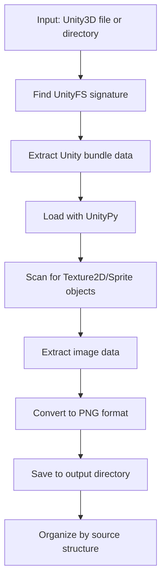

# Unity to PNG Extractor

A command-line utility to extract texture assets from Unity game files and convert them to PNG format.

## Usage

### Extract from a single file:

```bash
py unity_image_extractor.py "path\to\file.unity3d"
```

### Extract from an entire folder:

```bash
py unity_image_extractor.py "path\to\directory" -r
```

### With custom output directory:

```bash
py unity_image_extractor.py "source" -o "output_dir" -r
```

## What it does

This tool reads Unity `.unity3d` bundle files, identifies texture and sprite assets within them, and exports each asset as a separate `.png` file. It's designed for developers, artists, and researchers who need to inspect game assets for personal or educational purposes.

## Features

- **Direct Extraction:** Processes Unity3D bundle files
- **PNG Conversion:** Exports all found Texture2D and Sprite assets into PNG images
- **Batch Processing:** Can run on a single file or recursively through directories
- **CLI Interface:** Simple and fast command-line operation

## How it works



## Getting Started

### Prerequisites

- Python 3.6+
- UnityPy: `pip install UnityPy`
- PIL/Pillow: `pip install Pillow`

### Installation

1. Ensure Python and required packages are installed
2. Place the script in your desired directory

## Output

Images are saved as PNG files in `Unity_Image_Extractor/extracted_images/`, organized by source file names and subdirectories.

## Disclaimer

This tool is intended for educational and personal use only. All extracted assets are the intellectual property of their respective creators and copyright holders. Do not use the output for commercial purposes or for the redistribution of assets.