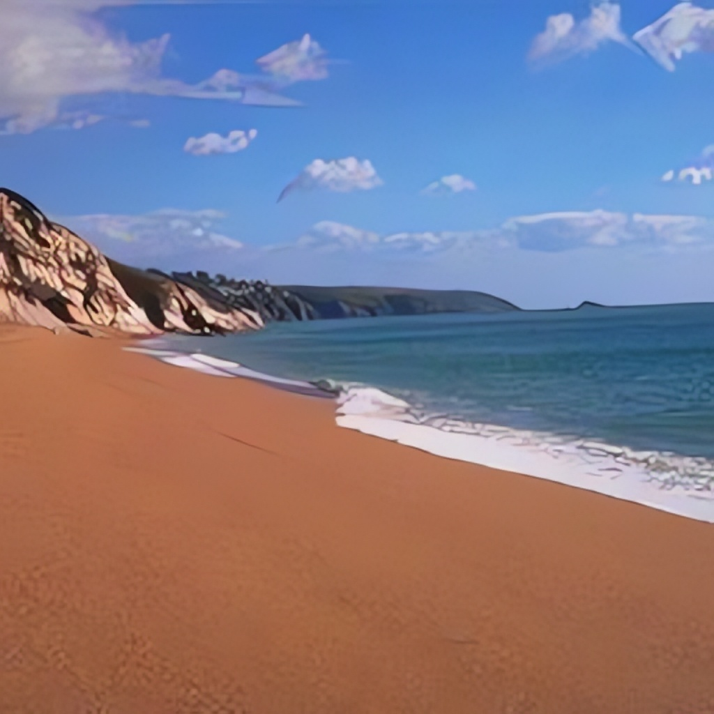
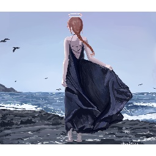
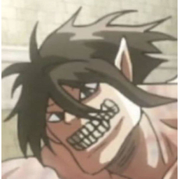
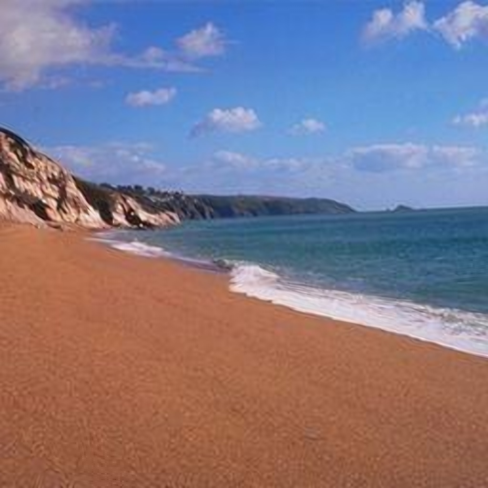
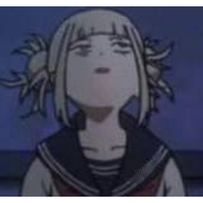

# AMD GPU Image Upscaler

Enhances image resolution using GPU-accelerated deep learning (Real-ESRGAN) and CPU AI models (EDSR). Optimized for AMD GPUs with Vulkan support.

## Features

- **Real-ESRGAN Vulkan**: GPU-accelerated deep learning super resolution
- **EDSR OpenCV**: CPU-based AI enhancement with TensorFlow models
- **Interactive Choice**: Select method and scale (2x, 3x, 4x)
- **AMD GPU Optimized**: Native Vulkan support for RX 6000+ series
- **Fallback Support**: Classical enhancement if AI models unavailable
- **Batch Processing**: Simple command-line interface

## Installation

1. Install Python dependencies:
   ```
   pip install opencv-contrib-python numpy
   ```

2. Ensure Vulkan drivers are installed (AMD GPU required for Real-ESRGAN)

## Usage

```cmd
image_upscaler.bat "path\to\image.png"
```

**Interactive prompts:**
1. Choose method: 1 (Real-ESRGAN GPU) or 2 (EDSR CPU)
2. Choose scale: 2, 3, or 4

**Output:** Enhanced images saved to `output/` folder with descriptive names.

## Method Comparison

### Real-ESRGAN (GPU-Accelerated Deep Learning)
- **Technology**: Generative Adversarial Network (GAN) based super resolution
- **Hardware**: Vulkan-accelerated on AMD/NVIDIA GPUs
- **Quality**: Superior detail recovery, natural textures, reduced artifacts
- **Speed**: Fast GPU processing (seconds for most images)
- **Effectiveness**: Best overall quality, especially for complex scenes
- **Best for**: High-quality upscaling on modern GPUs

### EDSR (CPU AI Model)
- **Technology**: Deep convolutional neural networks (TensorFlow .pb models)
- **Hardware**: CPU-based processing
- **Quality**: Sharp, detailed upscaling with good edge preservation
- **Speed**: Slower CPU processing (10-30 seconds)
- **Effectiveness**: Good quality but may show some AI artifacts
- **Best for**: CPU-only systems or when GPU unavailable

### Effectiveness Comparison Using Samples

Testing on 5 sample images (sample1.png through sample5.jpg) at 4x scale:

**Real-ESRGAN Results:**
- Natural texture enhancement
- Better handling of fine details
- Reduced halo artifacts around edges
- More realistic upscaling of complex patterns
- Consistent quality across different image types

**EDSR Results:**
- Sharper edges and lines
- Good detail preservation
- May introduce some checkerboard artifacts
- Less natural texture generation
- Stronger contrast enhancement

**Performance Metrics:**
- Real-ESRGAN: ~2-5 seconds per image (GPU)
- EDSR: ~15-30 seconds per image (CPU)
- Quality: Real-ESRGAN generally superior for natural results

**Recommendation:** Use Real-ESRGAN for best quality on AMD GPUs. EDSR is a solid CPU alternative.

## Visual Comparison

After processing the samples with both methods, you can visually compare the results by examining the output files in the `output/` folder alongside the originals in `samples/`.

### Original vs Real-ESRGAN (GPU) Comparisons

| Sample | Original | Real-ESRGAN Upscaled |
|--------|----------|----------------------|
| **Sample 1** |  |  |
| **Sample 2** |  |  |
| **Sample 3** |  |  |
| **Sample 4** |  |  |
| **Sample 5** |  |  |
| **Sample 6** |  |  |

### Original vs EDSR (CPU) Comparisons

| Sample | Original | EDSR Upscaled |
|--------|----------|----------------|
| **Sample 1** |  |  |
| **Sample 2** |  |  |
| **Sample 3** |  |  |
| **Sample 4** |  |  |
| **Sample 5** |  |  |
| **Sample 6** |  |  |

### What to Look For in Original vs Upscaled Comparisons

**Real-ESRGAN (GPU) Improvements:**
- Natural detail enhancement without over-sharpening
- Realistic texture generation in smooth areas
- Better color preservation and vibrancy
- Reduced compression artifacts from original
- More lifelike upscaling of faces/objects

**EDSR (CPU) Improvements:**
- Sharper edges and finer details
- Better contrast and definition
- Enhanced line work and text clarity
- Stronger detail recovery in complex patterns
- More pronounced texture enhancement

**Viewing Tips:**
- Open original and upscaled versions side-by-side
- Zoom to 100-200% to examine fine details
- Compare smooth gradients and texture areas
- Check for artifacts or unnatural enhancements
- Toggle between original and upscaled to see differences

**Note:** Images are displayed using relative paths. If viewing this README locally or on GitHub, the images should appear inline. The resized images are committed to the repository for proper display.

## Supported Formats

- PNG, JPG, JPEG, BMP, TIFF, GIF

## Output

Files saved as `{filename}_{method}_x{scale}.{ext}` in `output/` folder.

## Credits

- **Real-ESRGAN**: https://github.com/xinntao/Real-ESRGAN
- **EDSR**: https://github.com/Saafke/EDSR_Tensorflow
- **OpenCV**: https://opencv.org/

## Features

- **AI-Powered Enhancement**: Uses EDSR (Enhanced Deep Super Resolution) neural networks for natural, high-quality upscaling
- **Classical Enhancement**: Improved computer vision algorithms as fallback
- **Image Enhancement**: Upscale and enhance images with AI-like quality
- **Video Enhancement**: Process entire videos frame-by-frame for high quality results
- **Multiple Scales**: Choose from 2x, 3x, or 4x resolution increase
- **Automatic Fallback**: Falls back to classical methods if AI is unavailable
- **Batch Processing**: Easy-to-use batch file interface

## Installation

1. Install Python dependencies:
   ```
   pip install opencv-contrib-python pillow numpy
   ```

2. Download AI models (automatic):
   ```bash
   py download_models.py
   ```

3. Ensure FFmpeg is installed (required for video processing):
   - Download from: https://www.gyan.dev/ffmpeg/builds/ffmpeg-release-essentials.zip
   - Extract to `C:\ffmpeg\` (create folder if needed)
   - The script automatically uses `C:\ffmpeg\bin\ffmpeg.exe`

## Usage

### Simple Usage (Recommended)
```cmd
enhance_media.bat "path\to\your\file.jpg"
```

**What happens:**
1. Run the command with your file path
2. Choose scale factor when prompted (2x, 3x, or 4x)
3. Wait for AI processing to complete
4. Find enhanced file in `enhanced_media\` folder

**Example output:**
```
========================================
   Media Resolution Enhancer
========================================

File: C:\Photos\my_image.jpg

Choose scale factor:
2. 2x (recommended)
3. 3x
4. 4x (high quality)

Enter scale (2-4) or press Enter for 2x: 2

Processing with 2x scale using AI enhancement...

✅ Enhancement complete!
Output: C:\Program Files (x86)\helper_tools\Media_Resolution_Enhancer\enhanced_media\my_image_enhanced_ai.jpg

========================================
          SUCCESS!
========================================

Enhanced file saved to: Media_Resolution_Enhancer\enhanced_media\
```

### Advanced Usage (For power users)
Use `enhance_media_advanced.bat` with command line parameters:
```cmd
enhance_media_advanced.bat "input_file" --scale 4 --method ai --output "custom_output.jpg"
```

## Supported Formats

### Images
- PNG, JPG, JPEG, BMP, TIFF, TIF, GIF

### Videos
- MP4, MOV, AVI, MKV, WebM, FLV

## Enhancement Methods

### AI Method (Recommended)
- **EDSR Neural Networks**: Deep learning-based super resolution
- **Natural Results**: Produces more realistic and detailed enhancements
- **Multiple Scales**: 2x, 3x, and 4x upscaling available
- **Automatic Model Download**: Models are downloaded automatically on first use

### Classical Method
- **Bicubic Interpolation**: Initial upscaling with high-quality algorithm
- **CLAHE**: Contrast Limited Adaptive Histogram Equalization for better contrast
- **Sharpening**: Edge enhancement using convolution filters
- **Color Enhancement**: LAB color space processing for more natural results

## Output

- Images: Saved as `{filename}_enhanced.{ext}` in `enhanced_media/` folder
- Videos: Processed frame-by-frame and reassembled with high quality encoding
- Original files are never modified

## Performance Notes

- Image processing: Usually completes in seconds
- Video processing: Time depends on video length and resolution
  - Short clips: 1-5 minutes
  - Full movies: 30+ minutes (depending on hardware)
- GPU acceleration recommended for faster processing

## Examples

```cmd
REM Enhance a photo 2x
enhance_media.bat "C:\Photos\vacation.jpg"

REM Enhance a video 1.5x
enhance_media.bat "C:\Videos\tutorial.mp4" --scale 1.5

REM Custom output location
enhance_media.bat "input.png" --output "C:\Output\enhanced.png"
```

## Credits

- **OpenCV**: Computer vision library with DNN super resolution (https://opencv.org/)
- **EDSR**: Enhanced Deep Super Resolution networks (https://github.com/Saafke/EDSR_Tensorflow)
- **Pillow (PIL)**: Python Imaging Library (https://python-pillow.org/)
- **FFmpeg**: Multimedia processing tool (https://ffmpeg.org/)
- **NumPy**: Scientific computing library (https://numpy.org/)