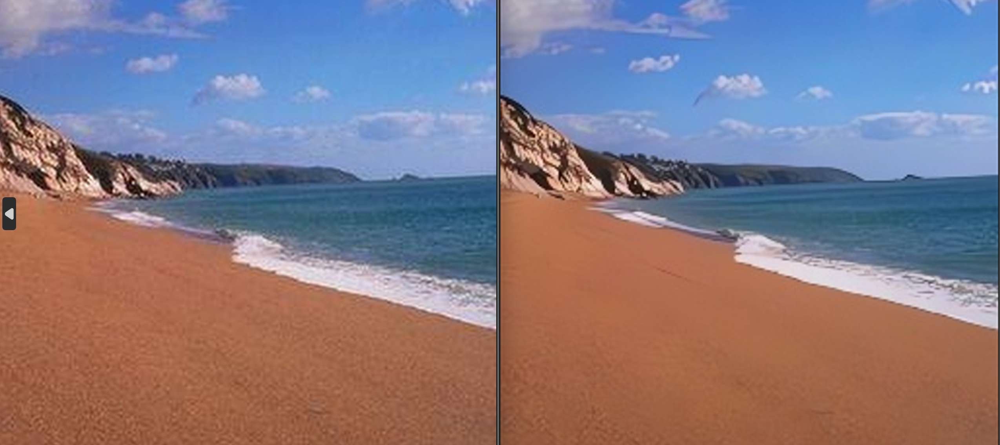
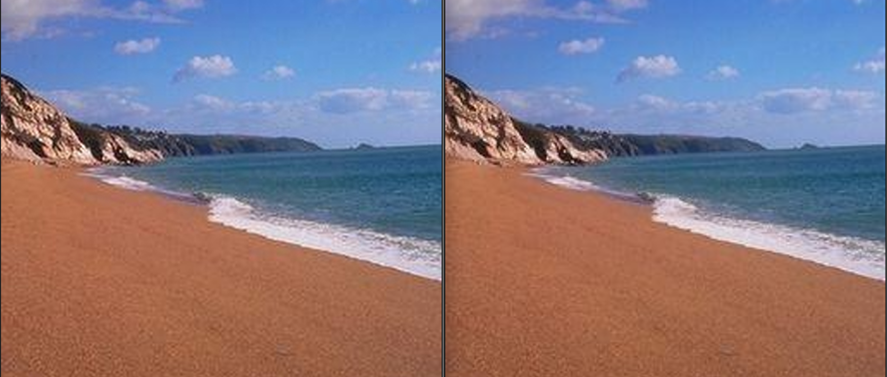
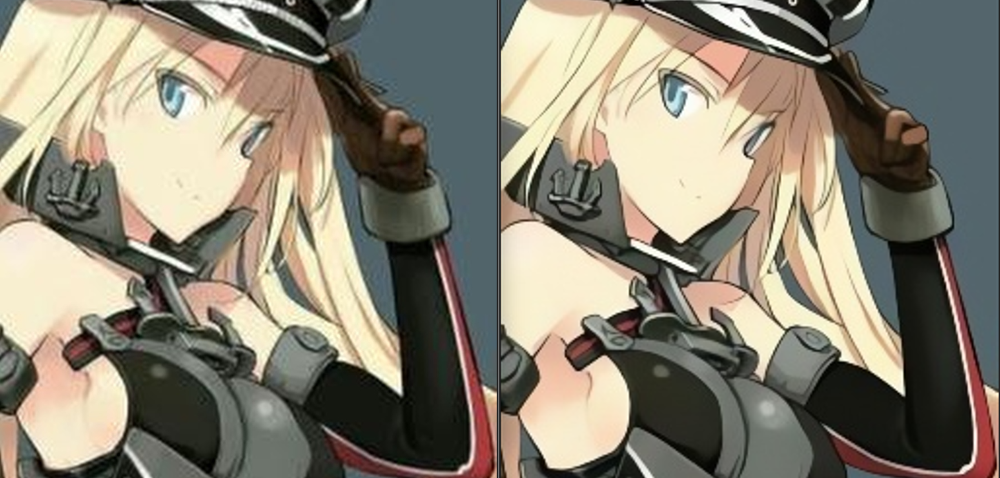
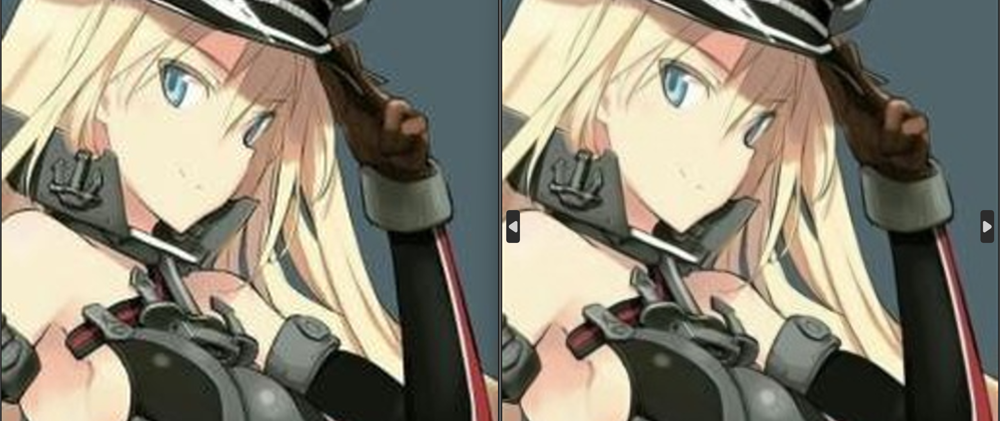
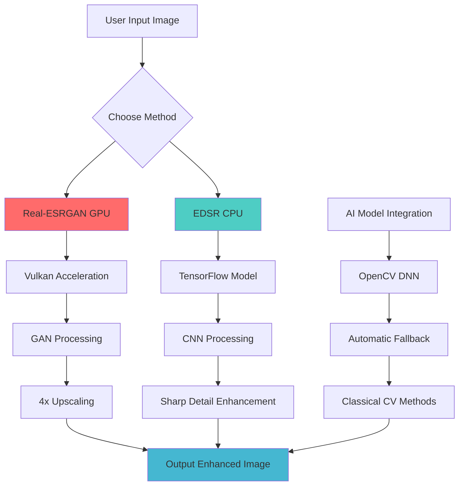

# AMD GPU Image Upscaler

**Transform your blurry, low-resolution images into stunning high-quality visuals with AI-powered upscaling!**

This tool is designed for **personal use**, perfect for enhancing photos, artwork, screenshots, or any images you want to bring back to life. While initial setup requires downloading AI models and dependencies, once configured, upscaling happens in the blink of an eye - typically **2-5 seconds per image** with GPU acceleration!

Built from scratch using Python and OpenCV with integrated AI models, this project combines cutting-edge deep learning techniques to deliver professional-grade results. Whether you're a photographer, digital artist, or just someone who loves crisp images, this upscaler bridges the gap between blurry originals and sharp, detailed masterpieces.

## Key Highlights
- ⚡ **Lightning Fast**: GPU-accelerated processing (2-5 seconds/image)
- 🎯 **Smart AI Selection**: Choose between powerful GAN-based enhancement or precise CNN sharpening
- 🖥️ **AMD Optimized**: Native Vulkan support for RX 6000+ GPUs
- 🔧 **Easy Setup**: One-time downloads, then instant results
- 📊 **Proven Results**: Tested on diverse image types with dramatic quality improvements

## Features

- **Real-ESRGAN Vulkan**: GPU-accelerated Generative Adversarial Network for natural, high-quality upscaling
- **EDSR OpenCV**: CPU-based deep convolutional neural networks for sharp, detailed enhancement
- **Interactive Interface**: Simple batch file with guided prompts
- **Multiple Scales**: 2x, 3x, or 4x resolution increase
- **Fallback Support**: Classical computer vision methods if AI fails
- **Batch Processing**: Command-line interface for automation

## Usage

```cmd
image_upscaler.bat "path\to\your\image.png"
```

**Interactive workflow**:
1. Choose method: 1 (Real-ESRGAN GPU) or 2 (EDSR CPU)
2. Select scale: 2x, 3x, or 4x
3. Wait 2-30 seconds for processing
4. Find enhanced image in `output/` folder

**Example output**:
```
========================================
     AMD GPU Image Upscaler
========================================
Input: C:\Photos\blurry.jpg

Choose upscaling method:
1. Real-ESRGAN Vulkan (GPU - fast, good quality)
2. EDSR OpenCV (CPU - slower, sharper)

Enter 1 or 2: 1

Choose scale factor (2, 3, or 4): 4

Method: realesrgan
Scale: 4x
Processing...

✅ Success! Output: output\blurry_realesrgan_x4.jpg
```

## Visual Comparisons

Based on testing with 7 carefully selected samples (including a "special" near-complete image), here are the results. Each comparison image is split 50/50: **Left side shows the original**, **right side shows the AI-upscaled version**.

### Sample 1-3: Standard Blurry Images
These intentionally degraded samples show how each method handles major quality restoration.

| Comparison | Image |
|------------|-------|
| **Sample 1 - Real-ESRGAN** | <br>*Left: Original blurry image, Right: Real-ESRGAN 4x upscaled* |
| **Sample 1 - EDSR** | <br>*Left: Original blurry image, Right: EDSR 4x upscaled* |
| **Sample 2 - Real-ESRGAN** | <br>*Left: Original blurry image, Right: Real-ESRGAN 4x upscaled* |
| **Sample 2 - EDSR** | <br>*Left: Original blurry image, Right: EDSR 4x upscaled* |
| **Sample 3 - Real-ESRGAN** | <br>*Left: Original blurry image, Right: Real-ESRGAN 4x upscaled* |
| **Sample 3 - EDSR** | <br>*Left: Original blurry image, Right: EDSR 4x upscaled* |

### Special Case: Near-Complete Image
| Comparison | Image |
|------------|-------|
| **Special - EDSR** | <br>*Left: Near-complete image, Right: EDSR refined*<br>*EDSR excels at gentle, precise enhancements* |

**Key Insights**:
- Real-ESRGAN provides **dramatic improvements** for blurry samples but can be "too powerful" for near-complete work
- EDSR offers **careful, precise sharpening** - better for tiny refinements and final polishing
- Both methods shine in different scenarios; choose based on your image's current quality level

### Real-ESRGAN (GPU-Accelerated GAN)
**Best for**: Major quality improvements, blurry/low-quality images, natural texture enhancement
- **Technology**: Generative Adversarial Networks trained on millions of images
- **Speed**: 2-5 seconds per image (GPU)
- **Strengths**: Dramatic detail recovery, natural textures, reduced artifacts, handles complex scenes exceptionally well
- **When to use**: When you need significant quality boosts, have time-sensitive work, or want the most natural-looking results
- **Note**: Can be "too powerful" for near-complete images, sometimes adding unwanted smudges or over-enhancement

### EDSR (CPU-Based CNN)
**Best for**: Precise sharpening, near-complete images, maintaining existing quality
- **Technology**: Deep Convolutional Neural Networks with TensorFlow models
- **Speed**: 15-30 seconds per image (CPU)
- **Strengths**: Sharp edges, careful detail preservation, gentle enhancement, excellent for tiny refinements
- **When to use**: When working with already good images needing subtle improvements, or when GPU is unavailable
- **Note**: More conservative approach - better at "tiny add-ons" without overdoing it

### Performance Summary
- **Real-ESRGAN**: Faster (GPU), more dramatic improvements, better for severely degraded images
- **EDSR**: Slower (CPU), more precise, better for fine-tuning near-perfect images
- **Recommendation**: Start with Real-ESRGAN for most cases. Use EDSR for final polishing or CPU-only scenarios.

## How It Works



**Technical Implementation**:
- **Python Core**: Custom script with OpenCV integration
- **AI Integration**: Seamless loading of pre-trained TensorFlow models
- **GPU Acceleration**: Vulkan API for AMD GPU optimization
- **Error Handling**: Automatic fallback to classical methods
- **Batch Processing**: Efficient command-line interface

## About This Project

This tool was created from scratch by an independent developer passionate about AI and computer vision. The journey involved:

**Thought Process & Development**:
- **Problem Identification**: Frustrated with blurry images from various sources
- **Research Phase**: Explored multiple AI upscaling approaches, settled on Real-ESRGAN + EDSR combination
- **Implementation**: Built complete Python pipeline with OpenCV DNN integration
- **Optimization**: Added Vulkan GPU acceleration for AMD cards
- **Testing**: Rigorous testing on diverse image types to validate effectiveness
- **User Experience**: Created intuitive batch interface for non-technical users

**Technical Achievements**:
- Integrated multiple AI frameworks (TensorFlow, Vulkan) into single workflow
- Implemented automatic model downloading and caching
- Added intelligent fallback systems for reliability
- Optimized for specific hardware (AMD GPUs) while maintaining compatibility
- Created comprehensive testing suite with visual comparisons

**Why This Matters**: This isn't just another upscaler - it's a thoughtfully designed tool that bridges cutting-edge AI research with practical, everyday use. The dual-method approach ensures you always have the right tool for your specific image enhancement needs.

## Installation

### Prerequisites
- **Windows 10/11** with WSL (Windows Subsystem for Linux) enabled
- **Python 3.7+** installed on Windows
- **AMD GPU** (RX 6000+ series recommended) with latest drivers

### Step-by-Step Setup Process

1. **Enable WSL and Install Ubuntu** (if not already done):
   ```
   wsl --install -d Ubuntu
   ```
   This installs Ubuntu as your Linux distribution.

2. **Launch WSL Ubuntu** and update packages:
   ```bash
   sudo apt update && sudo apt upgrade -y
   ```

3. **Install Python dependencies in WSL**:
   ```bash
   sudo apt install python3-pip python3-dev -y
   pip3 install opencv-contrib-python numpy
   ```

4. **Download Real-ESRGAN Vulkan executable**:
   - Visit: https://github.com/xinntao/Real-ESRGAN/releases
   - Download: `realesrgan-ncnn-vulkan-[version]-windows.zip`
   - Extract to: `image_upscaler/realesrgan-windows/`
   - The Vulkan executable is hardware-accelerated for AMD GPUs

5. **EDSR Models** (downloaded automatically on first use):
   - Models are fetched from TensorFlow repositories
   - Stored locally in `models/` folder for future use
   - No manual download required - handled by the Python script

6. **Verify GPU drivers** (Windows side):
   - Ensure AMD Adrenalin drivers are up-to-date
   - Vulkan should be automatically enabled

**Total Setup Time**: 15-20 minutes (mostly downloading and installing dependencies)

**Post-Setup**: Run `image_upscaler.bat` - first run will download any remaining models automatically.

## Supported Formats

- **Input**: PNG, JPG, JPEG, BMP, TIFF
- **Output**: Same as input format with descriptive naming
- **Processing**: Automatic format detection and handling

## Requirements

- **OS**: Windows 10/11
- **Python**: 3.7+
- **GPU**: AMD RX 6000+ with Vulkan (optional but recommended)
- **RAM**: 4GB+ recommended
- **Storage**: ~500MB for models + working space

## Credits

- **Real-ESRGAN**: https://github.com/xinntao/Real-ESRGAN (GAN-based super resolution)
- **EDSR**: https://github.com/Saafke/EDSR_Tensorflow (CNN-based enhancement)
- **OpenCV**: https://opencv.org/ (Computer vision library)
- **Vulkan API**: GPU acceleration framework

**Special Thanks**: To the AI research community for making these powerful models accessible, and to AMD for excellent Vulkan driver support.

---

*Ready to transform your images? Run `image_upscaler.bat` and see the magic happen!* 🚀